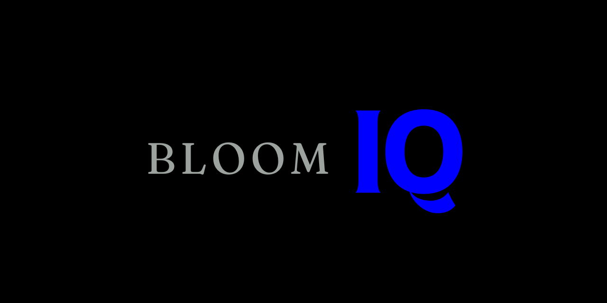
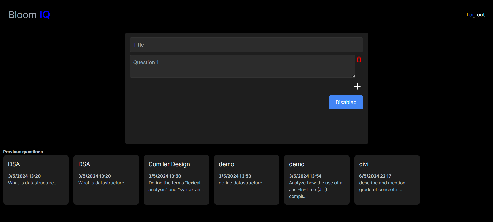
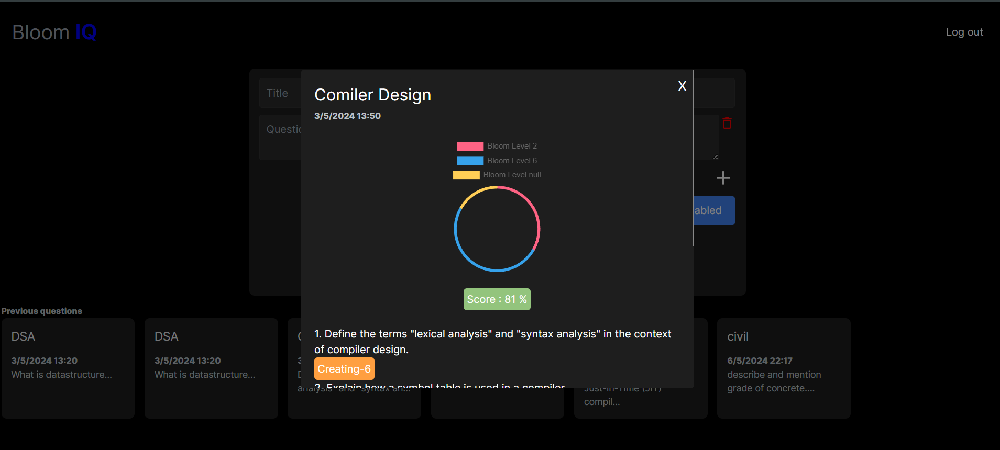

# Bloom's Taxonomy Question Paper Scoring System



## Table of Contents
- [Introduction](#introduction)
- [Features](#features)
- [Tech Stack](#tech-stack)
- [Screenshots](#screenshots)
- [Installation](#installation)
- [Usage](#usage)
- [Components](#components)
- [Contributing](#contributing)

## Introduction
This project is a web application built with Next.js, MongoDB, Chart.js, and React to evaluate the score of a question paper based on Bloom's Taxonomy. The system analyzes questions and categorizes them according to Bloom's levels of cognitive skills.

## Features
- **Question Analysis**: Evaluate and categorize questions based on Bloom's Taxonomy.
- **Score Visualization**: Visualize scores using interactive charts.
- **User Authentication**: Secure user authentication system.
- **Question Management**: Add, edit, and delete questions.
- **Responsive Design**: Mobile-friendly interface.

## Tech Stack
-  : Framework for server-rendered React applications.
-  : NoSQL database for storing questions and user data.
-  : Library for creating charts to visualize scores.
-  : JavaScript library for building user interfaces.

## Screenshots

*Dashboard with overview of scores.*


*Interactive chart showing question scores.*

## Installation
To get started with this project, follow the steps below:


1. **Install dependencies**
    ```bash
    npm install
    ```

2. **Set up MongoDB**
    - Ensure MongoDB is installed and running.
    - Create a `.env` file in the root directory and add your MongoDB connection string.
      ```env
      MONGODB_URI=mongodb://localhost:27017/your-database-name
      ```
    - There is Two databese modesls for users, questionSet and each has a databse configuration file.

3. **Run the development server**
    ```bash
    npm run dev
    ```

    Open [http://localhost:3000](http://localhost:3000) with your browser to see the result.

## Usage
- **Add Questions**: Navigate to the add questions page and fill in the details.
- **Analyze Questions**: The system automatically categorizes and scores questions based on Bloom's Taxonomy.
- **View Scores**: Check the dashboard for a summary of scores and detailed analysis.
- **Search**- To be added.
- **Add Custom Templates**- to be added.

## Components
- **Navbar**: Navigation bar with functionality of Login/Logout.
- **Dashboard**: Main interface displaying an overview of scores and stored question set.
- **QuestionForm**: Form component for adding and editing questions.
- **QuestionList**: List component displaying all questions set.
- **Chart**: Chart component for visualizing scores using Chart.js.
- **Loaders**: Page and Component loaders.

## Routes
- **analyse**: Analyse the input from the form and stores.
- **login**: Login using email and password.
- **signup**: Sign up.
- **dashboard**: Get all the old question sets with results.

## Contributing
### Contributions are welcome! Please fork the repository and create a pull request with your changes.

1. Fork the repository.
2. Create a new branch (`git checkout -b feature-branch`).
3. Commit your changes (`git commit -m 'Add some feature'`).
4. Push to the branch (`git push origin feature-branch`).
5. Open a pull request.

